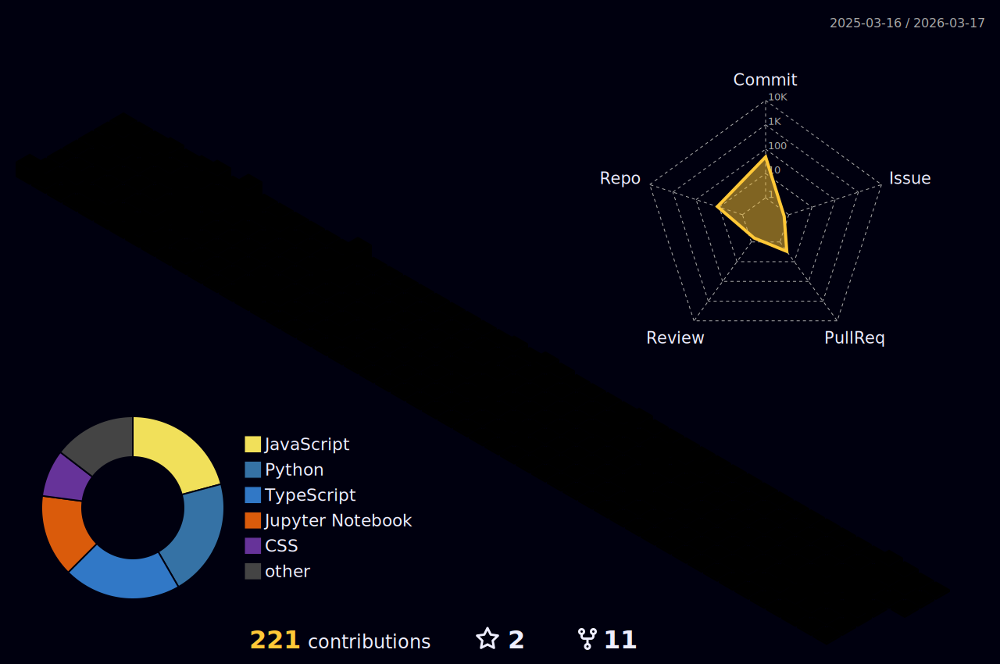

### Hi there 👋

# 📊 GitHub Stats:
 

<picture>
  <source media="(prefers-color-scheme: dark)" srcset="https://raw.githubusercontent.com/nitinya9av/nitinya9av/output/pacman-contribution-graph-dark.svg">
  <source media="(prefers-color-scheme: light)" srcset="https://raw.githubusercontent.com/nitinya9av/nitinya9av/output/pacman-contribution-graph.svg">
  
</picture>

# ✨ Badges

